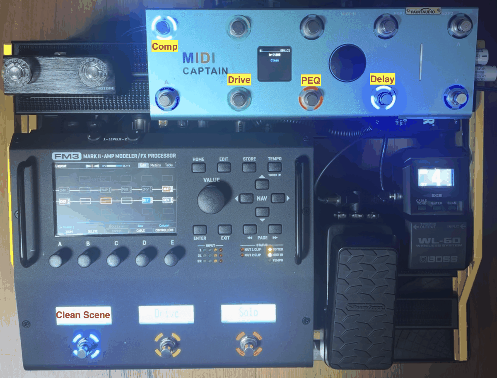

#+title: Readme

* Midi-Captain for FM3

/[[file:README.org][English]] | 한국어/

*Your MIDI Captain finally knows what your FM3 is doing.*

Bidirectional firmware for the Paint Audio MIDI Captain that keeps its LEDs and display
*in sync with the real state* of a Fractal FM3 — effect block on/off, channels, scenes,
preset/scene names, tempo and looper — using Fractal's SysEx protocol.
Change a scene on the FM3 and the pedal's LEDs follow. Toggle a block on the pedal and
the FM3 answers back. No more guessing which light means what.

미디캡틴은 원래 단방향(CC/PC) 컨트롤러라 FM3의 실제 상태를 알 수 없어, scene을 바꾸면
이펙트 on/off LED가 실제와 어긋나는 문제가 있습니다. 이 펌웨어는 Fractal SysEx로 FM3의
상태를 읽어 미디캡틴의 LED/화면을 항상 실제 상태와 일치시킵니다.

** ⚠ Disclaimer (면책 조항)
이 프로젝트는 Paint Audio MIDI Captain *상용 완제품의 펌웨어를 교체*하는 작업을 포함합니다.

- 설치 전 *반드시 기존 순정 펌웨어 전체를 백업*하십시오 (아래 [[*2. 순정 펌웨어 백업 (최초 1회, 필수)][설치 방법 2단계]] 참고). 백업이 없으면 순정 상태로 복원할 수 없습니다.
- 펌웨어 교체는 제조사 보증(warranty)을 무효화할 수 있습니다.
- 이 펌웨어를 설치·사용함으로써 발생하는 기기 오작동, 손상, 데이터 손실 등 *모든 결과에 대한 책임은 전적으로 사용자 본인에게 있습니다*.
- 이 프로젝트는 Paint Audio 및 Fractal Audio Systems와 무관한 개인 프로젝트이며, 어떠한 보증도 제공하지 않습니다 (NO WARRANTY).

** 프로젝트 목적

*** Pain Point
- 미디캡틴은 CC/PC 커맨드 등 단방향 통신 미디 컨트롤러이기 때문에 제어하는 대상 기기의 상태를 읽어들이지 못함
- Preset 변경, Scene 변경, Effects block 상태 변경 등 제어는 가능하나 effects block의 현 상태를 알지 못하여 effect on/off 상태 불일치가 발생함
- 예) Clean scene에서 OD1 scene으로 scene을 변경하여 Drive1 effect block이 on되었으나, 미디캡틴의 Drive1 on/off 스위치 상태는 여전히 off로 표시됨

*** 해결책
SysEx 미디 프로토콜(Fractal FM3/FM9 등에서 지원)을 사용한 *양방향 통신* 으로 FM3/FM9의 상태를 주기적으로 읽어 미디캡틴의 LED/Display에 실시간 반영
- Effects block on/off 및 채널(X/Y 등) 상태 동기화
- 현재 Scene 번호, Preset/Scene 이름, BPM 표시
- Tap tempo LED 동기화, Tuner 화면 표시

** 참고 사이트

+ [[https://github.com/nicola-lunghi/hiper-midicaptain?tab=readme-ov-file][hiper-midicaptain]] :: MidiCatain Customizing 출발점으로 좋은 사이트
  - Midi-Captain Spec 소개
  - Mu Editor를 사용한 Adafruit PySwitch Customizing 방법 소개

** 설치 방법
Paint Audio MIDI Captain (STD 10-switch 모델) 기준. 참고: [[https://github.com/nicola-lunghi/hiper-midicaptain][hiper-midicaptain]]

*** 0. MIDI 케이블 연결 — 양방향 (케이블 2개 필수)
이 펌웨어는 SysEx로 FM3의 상태를 *조회하고 응답을 받는* 양방향 통신을 사용하므로,
일반적인 미디 컨트롤러처럼 케이블 1개(MIDI OUT → IN)만 연결하면 동작하지 않습니다.
반드시 *5핀 MIDI 케이블 2개*로 양방향을 모두 연결하십시오.

| MIDI Captain | 방향 | FM3      | 용도                                        |
|--------------+------+----------+---------------------------------------------|
| MIDI OUT     | →    | MIDI IN  | 명령/조회 전송 (scene, effect, tap, 조회 등) |
| MIDI IN      | ←    | MIDI OUT | 상태 응답 수신 (effect 상태, 이름, BPM 등)  |

- FM3 쪽 MIDI OUT 포트가 *THRU*로 설정되어 있으면 응답이 나오지 않습니다. FM3 =SETUP > MIDI/Remote= 에서 MIDI OUT 모드를 확인하십시오.
- 케이블 1개만 연결된 경우 증상: 스위치로 제어는 되지만 LED/화면이 FM3 상태를 따라오지 않고 프리셋/씬 이름이 =---= 로 남습니다.

*** 1. USB Update Mode 진입
미디캡틴은 평상시 부팅에서는 USB 드라이브가 비활성화되어 있다 (기기가 config.json을 저장할 수 있도록 내부 파일시스템을 쓰기 가능 상태로 유지하기 위함 — boot.py 참고).

1. USB 케이블로 미디캡틴과 컴퓨터를 연결
2. *Switch 1 (왼쪽 위 풋스위치, GP1)을 누른 채* 전원을 켠다
3. 컴퓨터에 =MIDICAPTAIN= 이라는 USB 드라이브가 나타남

*** 2. 순정 펌웨어 백업 (최초 1회, 필수)
설치 전 =MIDICAPTAIN= 드라이브의 *전체 내용을 컴퓨터에 복사*해 둔다.
- 특히 =code.py=, =boot.py=, =lib/= 폴더
- 문제 발생 시 백업 파일을 다시 복사하면 순정 상태로 복원된다

*** 3. 프로젝트 파일 복사
이 저장소의 다음 파일/폴더를 =MIDICAPTAIN= 드라이브 루트에 *그대로 복사(덮어쓰기)* 한다.

| 파일/폴더    | 용도                                                       |
|--------------+------------------------------------------------------------|
| =code.py=    | 메인 펌웨어 (FM3 양방향 SysEx 컨트롤러)                     |
| =boot.py=    | 부팅 모드 제어 (Switch 1 → USB 드라이브)                   |
| =lib/=       | 필요한 CircuitPython 라이브러리 완성본 — *폴더째 복사*       |

=lib/= 에는 이 펌웨어가 필요로 하는 라이브러리 4종(=neopixel=, =adafruit_st7789=, =adafruit_midi=,
=adafruit_display_text=)이 CircuitPython 7.x용 =.mpy= 로 포함되어 있습니다 (Adafruit, MIT).
기기에 있던 기존 =lib/= 는 지우고 이 폴더로 교체하는 것을 권장합니다 — 다른 펌웨어(PySwitch 등)가
쓰던 잔여 파일이나 손상된 =.mpy= 가 남아 있으면 부팅 오류(=Corrupt .mpy file=)의 원인이 됩니다.

복사 후 드라이브 루트 구성:
#+begin_example
MIDICAPTAIN/
├── boot.py
├── code.py
└── lib/
    ├── neopixel.mpy
    ├── adafruit_st7789.mpy
    ├── adafruit_midi/
    └── adafruit_display_text/
#+end_example
(=config.json= 은 첫 부팅 시 자동 생성됩니다)

*** 4. 재부팅
1. USB 드라이브를 안전하게 추출 (eject)
2. 전원을 껐다가 (스위치를 누르지 않고) 다시 켠다
3. Welcome 화면과 LED 테스트 후 FM3 컨트롤러 모드로 동작

*** 5. 설정 변경
- 로터리 휠을 *1초 이상 길게 누르면* Edit Mode 진입 — 각 스위치의 기능(effect, scene, tap tempo, tuner 등)과 LED 색상을 기기에서 직접 편집
- 설정은 기기 내부 =config.json= 에 자동 저장됨
- 코드를 수정하려면 다시 1번의 Update Mode로 진입

*** 문제 해결
- 드라이브가 안 보일 때 :: 데이터 전송 지원 USB 케이블인지 확인 후, Switch 1을 누른 상태로 전원 on을 다시 시도
- 순정 복원 :: Update Mode 진입 후 백업해 둔 파일을 전부 덮어쓰기
- 개발/디버깅 :: [[https://learn.adafruit.com/welcome-to-circuitpython/installing-mu-editor][Mu Editor]] 시리얼 콘솔 사용 ([[https://github.com/nicola-lunghi/hiper-midicaptain][hiper-midicaptain]] 참고). autoreload가 기본 활성화되어 있어 =code.py= 저장 즉시 반영된다 (끄려면 =boot.py= 의 =supervisor.disable_autoreload()= 주석 해제)

** CircuitPython libs
Midicaptain CPU board에는 CircuitPython 7.3.1이 내장되어 있다.
필요한 라이브러리는 이 저장소의 =lib/= 폴더에 완성본으로 들어 있으므로 별도 다운로드가 필요 없다.

직접 최신 버전으로 교체하고 싶다면 반드시 *7.x용 mpy 번들*
([[https://github.com/adafruit/Adafruit_CircuitPython_Bundle/releases/download/20231003/adafruit-circuitpython-bundle-7.x-mpy-20231003.zip][adafruit-circuitpython-bundle-7.x-mpy-20231003.zip]])에서 추출할 것.
8.x/9.x 번들의 =.mpy= 는 포맷이 달라 7.3.1에서 로드되지 않는다. 라이선스 정보는 =lib/LICENSES.md= 참고.

** Midi-Captain H/W spec
*** Display (화면)                                                                                                                                                     
  |---------------+-------------------------------------------------------|
  | 항목          | 규격                                                  |
  |---------------+-------------------------------------------------------|
  | 타입          | Adafruit 1.54" Color IPS TFT LCD                      |
  | 컨트롤러 칩   | ST7789                                                |
  | 해상도        | 240 x 240 pixels                                      |
  | 통신 프로토콜 | SPI                                                   |
  | 핀 배치       | Clock(GP14), MOSI(GP15), DC(GP12), CS(GP13), PWM(GP8) |
  | 설정          | rowstart=80, rotation=180                             |
  |-              |                                                       |
  CircuitPython에서는 adafruit_st7789 라이브러리를 사용합니다.

*** Rotary Encoder (로터리 휠)
  |---------------+----------------------------|
  | 항목          | 규격                       |
  |---------------+----------------------------|
  | 타입          | Incremental Rotary Encoder |
  | Encoder A     | GP2                        |
  | Encoder B     | GP3                        |
  | Switch (누름) | GP0                        |
  | 프로토콜      | Digital GPIO Input         |
  |-              |                            |
  
*** 기타 주요 하드웨어
  |------------------+------------------------------------------------|
  | 항목             | 규격                                           |
  |------------------+------------------------------------------------|
  | MCU              | Raspberry Pi RP2040 (Dual-core ARM Cortex-M0+) |
  | 펌웨어           | CircuitPython 7.3.1                            |
  | LED              | 30개 Neopixel RGB (GP7) - 버튼당 3개씩         |
  | MIDI I/O         | UART (TX: GP16, RX: GP17)                      |
  | Expression Pedal | 아날로그 입력 2개 (GP27, GP28)                 |
  | 스위치           | 총 10개 풋스위치                               |
  | 무선             | BK2461 Serial RF 모듈                          |
  | 전원             | 배터리 + 전압 모니터링 (GP29)                  |
  |-                 |                                                |
  참고 출처: https://github.com/nicola-lunghi/hiper-midicaptain

*** 풋스위치 10개 GPIO 맵
  물리 배열
  
  |---+---+---+---+----|
  | 1 | 2 | 3 | 4 | UP |
  |---+---+---+---+----|
  | A | B | C | D | DN |
  |-  |   |   |   |    |
  GPIO 핀 매핑
  |-----------+------+----------------|
  | Switch    | GPIO | 비고           |
  |-----------+------+----------------|
  | Switch 1  | GP1  | Scene 1 / 5    |
  | Switch 2  | GP25 | Scene 2 / 6    |
  | Switch 3  | GP24 | Scene 3 / 7    |
  | Switch 4  | GP23 | Scene 4 / 8    |
  | Switch UP | GP20 | Tuner          |
  | Switch A  | GP9  | Comp1 on/off   |
  | Switch B  | GP10 | Drive1 on/off  |
  | Switch C  | GP11 | Delay1 on/off  |
  | Switch D  | GP18 | Chorus1 on/off |
  | Switch DN | GP19 | Tap Tempo      |
  |-          |      |                |
  Rotary Encoder (별도 3핀)
  |-------------------+------|
  | 기능              | GPIO |
  |-------------------+------|
  | Encoder SW (누름) | GP0  |
  | Encoder A         | GP2  |
  | Encoder B         | GP3  |
  |-                  |      |
** [[file:doc/user_manual.ko.org][사용자 매뉴얼]]
페이지/스위치 동작, LED 규칙, Edit Mode 조작법, Global Settings, 문제 해결

** Fractal Audio System SysEx Guide
- [[https://wiki.fractalaudio.com/wiki/index.php?title=MIDI_SysEx][Fractal Audio Wiki — MIDI SysEx]]
- "Axe-Fx III MIDI for Third-Party Devices" (Fractal Audio, PDF) — Fractal 포럼/위키에서 구할 수 있음 (저작권상 여기 재배포하지 않음)

** Issues
+ effects block이 현재 scene에 없을 때 LED 완전히 off

** 호환성 및 테스트 범위 (단서 조항)
실제 테스트를 마친 조합은 *Fractal FM3 + Paint Audio MIDI Captain (10-switch STD)* 뿐입니다.

*** Fractal 기기
| 기기         | 상태            | 비고                                                                     |
|--------------+-----------------+--------------------------------------------------------------------------|
| FM3          | *테스트 완료*   | =FM3_MODEL_ID = 0x11= (기본값)                                            |
| FM9          | 미테스트        | 동일 SysEx 프로토콜(Axe-Fx III 계열)이므로 원리상 동작 예상. model ID 0x12 |
| Axe-Fx III   | 미테스트        | 상동. model ID 0x10                                                      |

FM9/Axe-Fx III에서 사용하려면 code.py의 =FM3_MODEL_ID= 를 해당 기기의 SysEx model ID로 변경해야 합니다.
기기별 model ID는 [[https://wiki.fractalaudio.com/wiki/index.php?title=MIDI_SysEx][Fractal Audio Wiki — MIDI SysEx]] 참고:

| Model ID | 기기            |
|----------+-----------------|
| 0x00     | Axe-Fx Standard |
| 0x01     | Axe-Fx Ultra    |
| 0x02     | MFC-101         |
| 0x03     | Axe-Fx II       |
| 0x04     | MFC-101 mk3     |
| 0x05     | FX8             |
| 0x06     | Axe-Fx II XL    |
| 0x07     | Axe-Fx II XL+   |
| 0x08     | AX8             |
| 0x0A     | FX8 mk2         |
| 0x10     | Axe-Fx III      |
| 0x11     | FM3             |
| 0x12     | FM9             |
| 0x14     | VP4             |
| 0x15     | AM4             |

(Axe-Fx II 이하 구세대 기기는 SysEx 명령 체계 자체가 달라 이 프로젝트와 호환되지 않습니다)

*** MIDI Captain 모델
| 모델                  | 상태          | 비고                                        |
|-----------------------+---------------+---------------------------------------------|
| STD (10-switch)       | *테스트 완료* |                                             |
| ONE / DUO / NANO 4 / MINI 6 | *호환 불가* | Rotary wheel 또는 LED Screen이 없어 페이지 전환·Edit Mode·상태 표시가 불가능 |

FM9/Axe-Fx III에서 동작을 확인하신 분은 issue로 알려주시면 반영하겠습니다.

** License
[[file:LICENSE][MIT License]] — 상용 이용을 포함해 자유롭게 사용·수정·배포할 수 있습니다 (저작권 고지 유지 조건).
=lib/= 의 Adafruit 라이브러리도 MIT입니다 ([[file:lib/LICENSES.md][lib/LICENSES.md]]).
